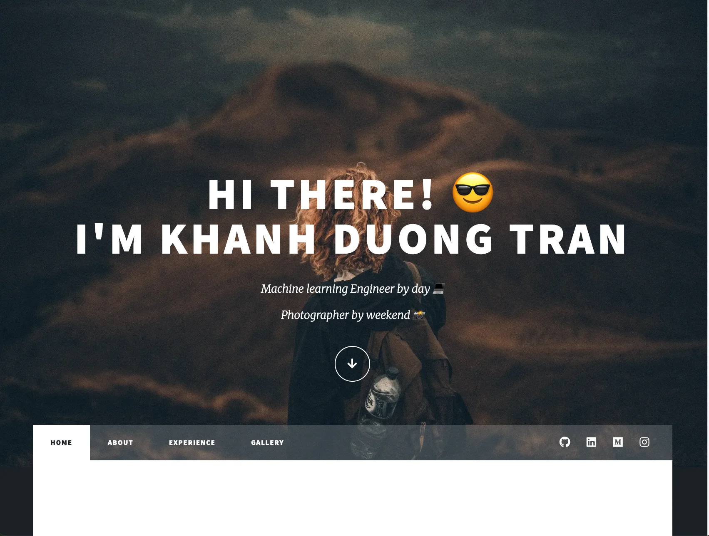

# Raydi TRAN - Portfolio Website



## 📖 Introduction
This repository hosts my personal portfolio website, designed to showcase my professional journey as an **Analytics Engineer**. The site serves as a central hub for:
- 💼 **Professional Experience**: My work history in Adtech and Data Engineering.
- 🛠️ **Project Showcase**: Live demos and code repositories for my ML and Data projects.
- 🎓 **Education**: Details on my Master's in Computer Science and certifications.
- 📷 **Photography Gallery**: A creative outlet featuring my photography work.

## 🚀 Live Demo
**[Visit raydiwill.github.io](https://raydiwill.github.io)**

## 🛠️ Tech Stack

### Core
- **HTML5 / CSS3 / SCSS**: Built on the "Massively" template with custom SCSS styling.
- **JavaScript (jQuery)**: Used for scroll effects (`scrollex`, `scrolly`) and UI interactions.
- **Assets**: FontAwesome icons and WebP optimized images.

### Functionality
- **Formspree**: Handles contact form submissions via AJAX (no redirects).
- **CSS Grid**: Used for the responsive masonry layout in the Gallery page.

### Build & Quality Assurance
- **npm**: Package management and script handling.
- **PurgeCSS**: Removes unused CSS to reduce file size.
- **Playwright**: End-to-End (E2E) automated testing framework.
- **html-validate**: Automated HTML static analysis.
- **GitHub Actions**: CI/CD pipeline for testing and deployment.

## 💡 Lessons Learned
Building this portfolio was a journey of learning modern web development practices beyond data engineering:

- **Package Management (npm)**: As a beginner to the Node ecosystem, I learned how to manage dependencies and run scripts efficiently.
- **Code Quality Tools**: Implemented `html-validate` to ensure semantic correctness and accessibility compliance automatically.
- **Automated Testing**: Learned **Playwright** to write E2E tests, ensuring the navigation, forms, and responsiveness work correctly without manual checking every time.
- **Performance Optimization**: Deep dived into **Lighthouse** scoring, optimizing images to **WebP** format and implementing lazy loading to achieve high performance scores.
- **SEO Optimization**: Understood the role of `robots.txt` and `sitemap.xml` to allow crawlers indexing necessary files.
- **AI-Assisted Development**: Leveraged AI tools to accelerate coding, debug CSS issues, and learn new technologies faster.

## 🏃‍♂️ Running Locally

1. **Clone the repository**
   ```bash
   git clone https://github.com/raydiwill/raydiwill.github.io.git
   cd raydiwill.github.io
   ```

2. **Install dependencies**
   ```bash
   npm install
   ```

3. **Run Tests**
   ```bash
   npx playwright test
   ```

4. **Serve locally**
   You can use VS Code's "Live Server" extension or:
   ```bash
   npx http-server .
   ```

## 📄 Credits
- Design template: [Massively](https://html5up.net/massively) by HTML5 UP.
- Icons: [Font Awesome](https://fontawesome.com).
- Images: Personal photography and project screenshots.